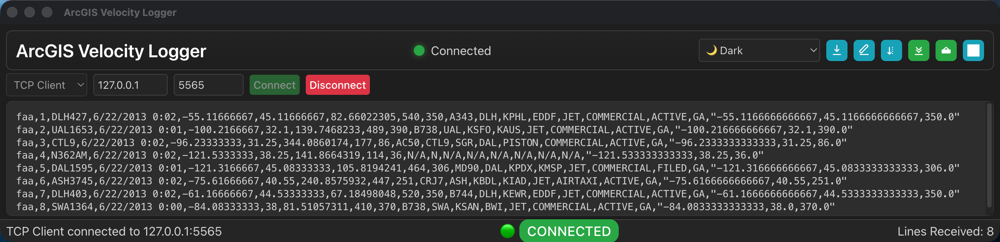

# ArcGIS Velocity Logger


<p style="text-align: center;">
  
</p>

<p style="text-align: center;"><em>Main ArcGIS Velocity Logger application interface.</em></p>

A cross-platform desktop application for capturing and logging network data from TCP and UDP connections. Designed to help debug and monitor ArcGIS Velocity feeds and other data sources.

## Documentation

> 📖 **[docs/README.md](./docs/README.md)** — full index of all documentation in this folder

| Guide | Summary |
|-------|---------|
| [Architecture](./docs/ARCHITECTURE.md) | Process topology, components, IPC, headless execution path, and security model |
| [Build & Package](./docs/BUILD.md) | All build scripts, compression options, sequential/parallel builds, and output artifacts |
| [Command-Line Reference](./docs/COMMAND-LINE.md) | All CLI parameters, headless mode, help layouts, and usage examples |
| [Configuration](./docs/CONFIG.md) | Config file format, all settings, themes, fonts, and storage locations |
| [Debugging](./docs/DEBUGGING.md) | Debug commands, DevTools and VSCode setup, headless debugging, common issues |
| [Development Summary](./docs/DEVELOPMENT-SUMMARY.md) | Technical implementation details and development decisions |
| [Documentation Index](./docs/DOCUMENTATION.md) | Full doc index with audience classification and maintenance notes |
| [gRPC Transport](./docs/GRPC.md) | gRPC modes, serialization formats (Protobuf/Kryo/Text), and TLS |
| [Headless Mode](./docs/HEADLESS.md) | No-UI capture: parameters, config file workflow, output formats, done file |
| [Keyboard Shortcuts](./docs/KEYBOARD-SHORTCUTS.md) | All keyboard shortcuts and context menu reference |
| [Release Notes](./docs/RELEASE-NOTES.md) | User-facing features and changes by release |
| [Release Process](./docs/RELEASE.md) | GitHub Actions workflow, version tagging, and code signing for all platforms |
| [Testing](./docs/TESTING.md) | Test commands, suite descriptions, and manual smoke tests |
| [Theme Refactor Summary](./docs/THEME-REFACTOR-SUMMARY.md) | Theme system refactoring: per-file CSS and dynamic loader |
| [Why Electron](./docs/WHY-ELECTRON.md) | Framework rationale and packaging overview |

### In-App Help

- **`F1`** — Help dialog
- **`F2`** — About dialog
- **`F3`** — Command Line Interface dialog (searchable CLI reference, copy/export)
- **`Ctrl/Cmd+I`** — Configuration dialog
- **Right-click** — Context menu (themes, fonts, opacity, tools)

### Config Templates

- [`launch-config.sample.json`](./docs/launch-config.sample.json) — generic headless template
- [`launch-config.server.sample.json`](./docs/launch-config.server.sample.json) — server-mode template
- [`launch-config.client.sample.json`](./docs/launch-config.client.sample.json) — client-mode template

## Features

- **Network Protocols**: TCP and UDP server/client modes with real-time data capture
- **Cross-platform**: Native support for macOS, Windows, and Linux
- **Data Management**: Save logs to files, clear display, and track message counts
- **Customizable UI**: 15 themes via dynamic loader, adjustable fonts, and window opacity control
- **Modern UI/UX**: Compact header with progressive control hiding, auto‑scroll toggle, ascending/descending order toggle, responsive status bar
- **Configuration**: Persistent settings with automatic save/restore
- **Developer Tools**: Built-in debugging support and error handling
- **About Dialog**: Modern design with detailed system/runtime info (App, Electron, Node.js, V8, OS platform/arch)
- **Error Handling**: Comprehensive error management with user-friendly dialogs
- **Accessibility**: High contrast themes and keyboard navigation support

## Quick Start

### Prerequisites
- [Node.js](https://nodejs.org/) (v18 or later)
- npm (included with Node.js)

### Installation & Running

```bash
git clone <repository-url>
cd arcgis-velocity-logger
npm install
```

| Command | Purpose |
|---------|---------|
| `npm start` | Run the application |
| `npm run debug-both` | Run with debugger attached (see [DEBUGGING.md](docs/DEBUGGING.md)) |

## Command Line / Headless Mode

The logger can be run with or without a UI. When launched with no parameters, the app starts in normal UI mode and restores all saved behavior from configuration. With `runMode=headless` (or `runMode=silent`) the app runs as a true no-UI process that captures network data — suitable for servers, CI pipelines, and consoles with no GUI support. Headless mode has **no required parameters**: by default it writes captured records to the console (stdout) in the selected `outputFormat`; add `outputFile=<path>` to write to a file instead.

```bash
# normal UI (default)
npm start

# headless TCP server, records echoed to the console (no parameters required)
npm run start:headless

# headless TCP server capturing to ./captured.log
npm run start:headless -- outputFile=./captured.log

# print command-line help
npm run help:cli
npm run help:cli:wide
npm run help:cli:narrow
```

Press <kbd>F3</kbd> in the app (or use **Help → Command Line Interface**, the context menu, or the toolbar `>_` button) to open an interactive reference for every CLI parameter. The dialog supports search, quick filter chips, active filter pills, sortable columns, copy/export of visible rows as `TSV`/`CSV`/`Markdown`/`JSON`, collapsible reference panels, a resizable parameter table, and a wider default first-open layout for easier reading of the shipped example commands. A visible hint below the table explains that you can drag the table’s bottom edge to resize the visible rows area.

See [**COMMAND-LINE.md**](docs/COMMAND-LINE.md) for the full parameter table and [**HEADLESS.md**](docs/HEADLESS.md) for headless-mode guidance.

### Using Pre-built Packages
Download the appropriate package from the `dist/` directory:
- **macOS**: `.dmg` or `.zip` file
- **Windows**: `.exe` installer or portable `.exe`
- **Linux**: `.AppImage` or `.deb` package

## Building from Source

### Current platform

| Command | Notes |
|---------|-------|
| `npm run dist` | Builds for the OS you are running on |

### Specific platform

| Command | Platforms | Notes |
|---------|-----------|-------|
| `npm run package:mac` | macOS | `.dmg`, `.zip` |
| `npm run package:win` | Windows | `.exe` installer, portable |
| `npm run package:win:zip` | Windows | ZIP archive (x64) |
| `npm run package:linux` | Linux | `.AppImage`, `.deb` |

### All platforms

| Command | Mode | Notes |
|---------|------|-------|
| `npm run package` | Parallel | Same as `package:all` |
| `npm run package:all` | Parallel | Alias for `package` |
| `npm run package:seq` | Sequential | Includes Windows ZIP |
| `npm run package:seq:clean` | Sequential | Cleans `dist/` first |
| `npm run clean` | — | Deletes `dist/` |

For full details on all build options, compression, and artifact names, see [BUILD.md](./docs/BUILD.md). To publish a release via GitHub Actions or locally, see [RELEASE.md](./docs/RELEASE.md).

> **Note:** Cross-platform builds may require additional setup. Build on the target OS for best results.

## Usage

### Connection Types
- **TCP Server**: Listen for incoming TCP connections on specified port
- **TCP Client**: Connect to a remote TCP server
- **UDP Server**: Listen for UDP packets on specified port
- **UDP Client**: Send UDP packets to a remote server

### Interface
- **Connection Panel**: Configure host, port, and connection type
- **Log Display**: Real-time data with line counter and horizontal scrolling
- **Header Controls**: Save logs, clear logs, toggle auto‑scroll, toggle list order (ascending/descending), show/hide connection panel, theme selector (also accessible via keyboard shortcuts)
- **Responsive Header**: Controls progressively hide (not wrap) as the window narrows to keep a single clean row
- **Status Indicator**: Visual connection state (connected, disconnected, error)
- **Status Bar**: Real-time connection status and message counter

### Keyboard Shortcuts
- **F1**: Help dialog
- **F2**: About dialog
- **F3**: Command Line Interface dialog
- **F12**: Developer tools
- **Ctrl+S** (Cmd+S): Save logs to file
- **Ctrl+C** (Cmd+C): Clear logs
- **Ctrl+I** (Cmd+I): Show configuration
- **Ctrl+Shift+A** (Cmd+Shift+A): Toggle Auto‑Scroll
- **Ctrl+Shift+O** (Cmd+Shift+O): Toggle Order (Ascending/Descending)
- **Right-click**: Context menu with themes, fonts, and settings

> See [KEYBOARD-SHORTCUTS.md](docs/KEYBOARD-SHORTCUTS.md) for complete shortcut reference.

## Configuration

Settings are automatically saved and restored between sessions:
- **Themes**: 15 built-in options (🔵 Blue, 🟡 Color Blind, 🌙 Dark, 🌫️ Dark Gray, 🟢 Green, ⚫ High Contrast, ☀️ Light, ☁️ Light Gray, 🌌 Midnight, ☕ Mocha, 🌊 Ocean, 🌸 Rose, 🌺 Rose Dark, 🌅 Sunset, 💻 System)
- **Window State**: Size, position, and opacity
- **Font Settings**: Size (6px-25px) and family (16 fonts including monospace, Arial, Georgia, Helvetica, and more)
- **Connection Preferences**: Last used connection settings

Configuration files are stored in platform-appropriate locations:
- **macOS**: `~/Library/Application Support/arcgis-velocity-logger/`
- **Windows**: `%APPDATA%\arcgis-velocity-logger\`
- **Linux**: `~/.config/arcgis-velocity-logger/`

> See [CONFIG.md](docs/CONFIG.md) for detailed configuration options and troubleshooting.

## Status Indicators

The application provides real-time status feedback through visual indicators:

| Status | Indicator | Description |
|--------|-----------|-------------|
| 🔴 Disconnected | Red dot | No active connection |
| 🟢 Connected | Green dot | Successfully connected |
| 🟡 Connecting | Yellow dot | Attempting to connect |
| 🟠 Disconnecting | Orange dot | Closing connection |
| ⚠️ Error | Warning icon | Connection or configuration error |

## Error Handling

The application includes comprehensive error handling:
- **Network Errors**: Connection failures, port conflicts, timeout issues
- **Configuration Errors**: Invalid settings, file permission issues
- **System Errors**: Memory issues, process crashes
- **User-Friendly Dialogs**: Clear error messages with troubleshooting suggestions

## Development

### Project Structure
```
src/
├── main.js              # Main Electron process; CLI parsing + UI/headless branching
├── renderer.js          # UI logic and event handling
├── preload.js           # Security bridge for renderer process
├── config.js            # Configuration management
├── cli-options.js       # Command-line parsing, validation, and help text generation
├── headless-runner.js   # No-UI capture runner (TCP/UDP → file or stdout) with exit codes
├── run-logger.js        # Diagnostic logger used by the headless runner
├── index.html           # Main application interface
├── help.html            # Help dialog content
├── cli.html / cli.css   # Command Line Interface (F3) dialog content + styles
├── about.html           # About dialog content
├── config.html          # Configuration dialog content
├── error.html           # Error dialog content
├── splash.html          # Splash screen
├── themes.css           # Minimal dark fallback (used only if theme loader fails)
├── style.css            # Main application styles
├── app-status.css       # Status indicator styles
├── help.css             # Help and CLI dialog shared styles
├── about.css            # About dialog styles
├── splash.css           # Splash screen styles
├── themes/              # Dynamic theme system
│   ├── theme-loader.js       # Dynamically loads theme-*.css
│   ├── theme-*.css           # 15 individual theme files
│   └── README.md             # Theme system docs
└── assets/              # Icons and resources

test/
├── run-all-tests.js          # Test aggregator (node test/run-all-tests.js)
├── cli-options.test.js       # CLI parser unit tests
├── headless-runner.test.js   # End-to-end TCP capture tests
└── help.test.js              # Help + Command Line Interface dialog interaction tests

docs/
├── COMMAND-LINE.md           # Full CLI parameter reference
├── HEADLESS.md               # Headless mode guide
├── TESTING.md                # Running tests and manual smoke checks
├── launch-config.sample.json    # Generic headless config template
├── launch-config.server.sample.json
├── launch-config.client.sample.json
└── ...                        # Other guides
```

### Key Components
- **ConfigManager**: Handles configuration persistence and validation
- **CLI Options Parser (`cli-options.js`)**: Parses `name=value` CLI arguments, validates headless options, merges optional `config=*.json` launch-config file, and produces help text in three layouts (standard, wide table, narrow table)
- **Headless Runner (`headless-runner.js`)**: True no-UI TCP/UDP capture to text/jsonl/csv with `maxLogCount`/`durationMs`/`idleTimeoutMs` triggers and a JSON `doneFile` artifact
- **RunLogger (`run-logger.js`)**: Minimal diagnostic logger used by the headless runner; writes to stdout/stderr and/or a dedicated log file, separate from captured data
- **Error Handling**: Centralized error management with user dialogs
- **IPC Communication**: Secure communication between main and renderer processes
- **Theme System**: Dynamic theme switching (per‑theme CSS files loaded on demand, minimal fallback in `themes.css`)
- **Network Management**: TCP/UDP connection handling with proper cleanup

### Security Features
- **Content Security Policy**: Restricted script execution
- **Preload Script**: Secure API exposure to renderer process
- **Input Validation**: Parameter validation for network connections
- **Error Isolation**: Graceful error handling without exposing system details


## Troubleshooting

### Common Issues
1. **Port Already in Use**: Try a different port number
2. **Connection Refused**: Verify host/port and firewall settings
3. **Configuration Not Saving**: Check file permissions in config directory
4. **Theme Not Applying**: Restart application after theme changes

### Getting Help
- Press **F1** for built-in help
- Check the [DEBUGGING.md](docs/DEBUGGING.md) for development issues
- Review [CONFIG.md](docs/CONFIG.md) for configuration problems

## Issues

Find a bug or want to request a new feature? Please let us know by [submitting an issue](../../issues).

## Contributing

Esri welcomes contributions from anyone and everyone. Please see our [guidelines for contributing](https://github.com/esri/contributing).

## License

Copyright 2026 Esri

Licensed under the Apache License, Version 2.0 (the "License");
you may not use this file except in compliance with the License.
You may obtain a copy of the License at

   http://www.apache.org/licenses/LICENSE-2.0

Unless required by applicable law or agreed to in writing, software
distributed under the License is distributed on an "AS IS" BASIS,
WITHOUT WARRANTIES OR CONDITIONS OF ANY KIND, either express or implied.
See the License for the specific language governing permissions and
limitations under the License.

A copy of the license is available in the repository's [LICENSE](LICENSE) file.
