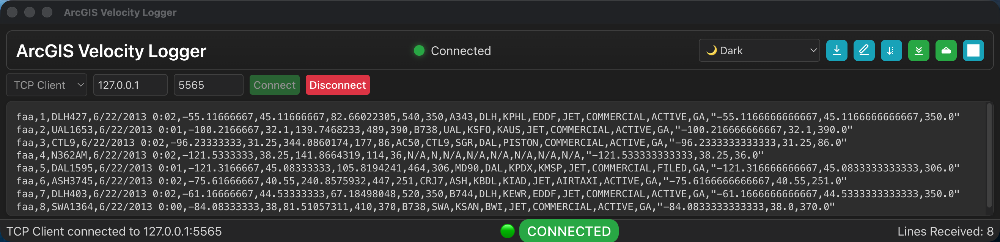

# ArcGIS Velocity Logger


<p style="text-align: center;">
  
</p>

<p style="text-align: center;"><em>Main ArcGIS Velocity Logger application interface.</em></p>

A cross-platform desktop application for capturing and logging network data from TCP and UDP connections. Designed to help debug and monitor ArcGIS Velocity feeds and other data sources.

## Documentation

See the [documentation index](docs/README.md) for the complete catalog by
purpose and audience.

- [Pre-fill a paired local test with connection presets](docs/connection-presets.md).
- [Review protocol settings and the connection summary](docs/connection-summary.md).
- [Get started with configuration](docs/configuration.md).
- [Run without the UI](docs/headless.md).
- [Use the command line](docs/command-line.md).
- [Configure XMPP receiving](docs/xmpp.md).
- [Develop, test, and debug](docs/developer-guide.md).
- [Build and release](docs/build-and-release.md).

### In-App Help

- **`F1`** — Help dialog
- **`F2`** — About dialog
- **`F3`** — Command Line Interface dialog (searchable CLI reference, copy/export)
- **`Ctrl/Cmd+I`** — Configuration dialog
- **`Ctrl/Cmd+Shift+P`** — Protocol Settings dialog
- **`Ctrl/Cmd+Shift+I`** — Connection summary
- **Right-click** — Context menu (themes, fonts, opacity, tools)

### Config Templates

- [Generic launch configuration](docs/examples/launch-config.sample.json)
- [Server-mode launch configuration](docs/examples/launch-config.server.sample.json)
- [Client-mode launch configuration](docs/examples/launch-config.client.sample.json)
- [XMPP launch configuration](docs/examples/launch-config.xmpp.sample.json)

## Features

- **Network Protocols**: TCP and UDP server/client modes with real-time data capture
- **XMPP**: Focused in-process C2S server and XMPP client receiving direct or MUC message bodies
- **Cross-platform**: Native support for macOS, Windows, and Linux
- **Data Management**: Save logs to files, clear display, and track message counts
- **Customizable UI**: 15 themes via dynamic loader, adjustable fonts, and window opacity control
- **Modern UI/UX**: Compact header with progressive control hiding, auto‑scroll toggle, ascending/descending order toggle, responsive status bar
- **Protocol Settings**: In-window dialog with Basics, Security, Advanced, and Summary sections, plus an on-demand connection summary, an always-visible warning alert, a status-bar entry, and a read-only connected view
- **Configuration**: Persistent settings with automatic save/restore
- **Developer Tools**: Built-in debugging support and error handling
- **About Dialog**: Modern design with detailed system/runtime info (App, Electron, Node.js, V8, OS platform/arch)
- **Error Handling**: Comprehensive error management with user-friendly dialogs
- **Accessibility**: High contrast themes and keyboard navigation support

## Quick Start

### Prerequisites
- [Node.js](https://nodejs.org/) (v18 or later)
- npm (included with Node.js)

### Installation & Running

```bash
git clone <repository-url>
cd arcgis-velocity-logger
npm install
```

| Command | Purpose |
|---------|---------|
| `npm start` | Run the application |
| `npm run debug-both` | Run with debugger attached (see the [developer guide](docs/developer-guide.md)) |

## Command Line / Headless Mode

The logger can be run with or without a UI. When launched with no parameters, the app starts in normal UI mode and restores all saved behavior from configuration. With `runMode=headless` (or `runMode=silent`) the app runs as a true no-UI process that captures network data — suitable for servers, CI pipelines, and consoles with no GUI support. Headless mode has **no required parameters**: by default it writes captured records to the console (stdout) in the selected `outputFormat`; add `outputFile=<path>` to write to a file instead.

```bash
# normal UI (default)
npm start

# headless TCP server, records echoed to the console (no parameters required)
npm run start:headless

# headless TCP server capturing to ./captured.log
npm run start:headless -- outputFile=./captured.log

# print command-line help
npm run help:cli
npm run help:cli:wide
npm run help:cli:narrow
```

Press <kbd>F3</kbd> in the app (or use **Help → Command Line Interface**, the context menu, or the toolbar `>_` button) to open an interactive reference for every CLI parameter. The dialog supports search, quick filter chips, active filter pills, sortable columns, copy/export of visible rows as `TSV`/`CSV`/`Markdown`/`JSON`, collapsible reference panels, a resizable parameter table, and a wider default first-open layout for easier reading of the shipped example commands. A visible hint below the table explains that you can drag the table’s bottom edge to resize the visible rows area.

See the [command-line reference](docs/command-line.md) for the full parameter
table and the [headless guide](docs/headless.md) for no-UI guidance.

### Using Pre-built Packages
Download the appropriate package from the `dist/` directory:
- **macOS**: `.dmg` or `.zip` file
- **Windows**: `.exe` installer or portable `.exe`
- **Linux**: `.AppImage` or `.deb` package

## Building from Source

### Current platform

| Command | Notes |
|---------|-------|
| `npm run dist` | Builds for the OS you are running on |

### Specific platform

| Command | Platforms | Notes |
|---------|-----------|-------|
| `npm run package:mac` | macOS | `.dmg`, `.zip` |
| `npm run package:win` | Windows | `.exe` installer, portable |
| `npm run package:win:zip` | Windows | ZIP archive (x64) |
| `npm run package:linux` | Linux | `.AppImage`, `.deb` |

### All platforms

| Command | Mode | Notes |
|---------|------|-------|
| `npm run package` | Parallel | Same as `package:all` |
| `npm run package:all` | Parallel | Alias for `package` |
| `npm run package:seq` | Sequential | Includes Windows ZIP |
| `npm run package:seq:clean` | Sequential | Cleans `dist/` first |
| `npm run clean` | — | Deletes `dist/` |

For build options, compression, artifact names, signing, and publishing with
`scripts/release.sh`, see the
[build and release guide](docs/build-and-release.md).

> [!NOTE]
> Cross-platform builds may require additional setup. Build on the target OS for best results.

## Usage

### Connection Types
- **TCP Server**: Listen for incoming TCP connections on specified port
- **TCP Client**: Connect to a remote TCP server
- **UDP Server**: Listen for UDP packets on specified port
- **UDP Client**: Send UDP packets to a remote server
- **XMPP Server**: Host a focused C2S service and receive direct or room messages
- **XMPP Client**: Connect to an XMPP service and receive direct or room messages

### Interface
- **Connection Panel**: Configure host, port, and connection type
- **Log Display**: Real-time data with line counter and horizontal scrolling
- **Header Controls**: Save logs, clear logs, toggle auto‑scroll, toggle list order (ascending/descending), show/hide connection panel, theme selector (also accessible via keyboard shortcuts)
- **Responsive Header**: Controls progressively hide (not wrap) as the window narrows to keep a single clean row
- **Status Indicator**: Visual connection state (connected, disconnected, error)
- **Status Bar**: Real-time connection status and message counter

### Keyboard Shortcuts
- **F1**: Help dialog
- **F2**: About dialog
- **F3**: Command Line Interface dialog
- **F12**: Developer tools
- **Ctrl+S** (Cmd+S): Save logs to file
- **Ctrl+C** (Cmd+C): Clear logs
- **Ctrl+I** (Cmd+I): Show configuration
- **Ctrl+Shift+A** (Cmd+Shift+A): Toggle Auto‑Scroll
- **Ctrl+Shift+O** (Cmd+Shift+O): Toggle Order (Ascending/Descending)
- **Right-click**: Context menu with themes, fonts, and settings

> See [keyboard shortcuts](docs/keyboard-shortcuts.md) for the complete reference.

## Configuration

Settings are automatically saved and restored between sessions:
- **Themes**: 15 built-in options (🔵 Blue, 🟡 Color Blind, 🌙 Dark, 🌫️ Dark Gray, 🟢 Green, ⚫ High Contrast, ☀️ Light, ☁️ Light Gray, 🌌 Midnight, ☕ Mocha, 🌊 Ocean, 🌸 Rose, 🌺 Rose Dark, 🌅 Sunset, 💻 System)
- **Window State**: Size, position, and opacity
- **Font Settings**: Size (6px-25px) and family (16 fonts including monospace, Arial, Georgia, Helvetica, and more)
- **Connection Preferences**: Last used connection settings

Configuration files are stored in platform-appropriate locations:
- **macOS**: `~/Library/Application Support/arcgis-velocity-logger/`
- **Windows**: `%APPDATA%\arcgis-velocity-logger\`
- **Linux**: `~/.config/arcgis-velocity-logger/`

> See the [configuration guide](docs/configuration.md) for options and
> troubleshooting.

## Status Indicators

The application provides real-time status feedback through visual indicators:

| Status | Indicator | Description |
|--------|-----------|-------------|
| 🔴 Disconnected | Red dot | No active connection |
| 🟢 Connected | Green dot | Successfully connected |
| 🟡 Connecting | Yellow dot | Attempting to connect |
| 🟠 Disconnecting | Orange dot | Closing connection |
| ⚠️ Error | Warning icon | Connection or configuration error |

## Error Handling

The application includes comprehensive error handling:
- **Network Errors**: Connection failures, port conflicts, timeout issues
- **Configuration Errors**: Invalid settings, file permission issues
- **System Errors**: Memory issues, process crashes
- **User-Friendly Dialogs**: Clear error messages with troubleshooting suggestions

## Development

```text
src/        # Main process, renderer, preload, transports, dialogs, themes, assets
scripts/    # Build, prerequisite, signing, and release tooling
test/       # Node.js test suites and browser fixtures
docs/       # All maintained documentation
```

| Task | Command |
|---------|---------|
| Run the app | `npm start` |
| Run every test suite | `npm test` |
| Check documentation links | `npm run docs:link-check` |
| Debug main and renderer | `npm run debug-both` |

See the [developer guide](docs/developer-guide.md) for the full repository
layout, testing workflow, debugging setup, and the patterns for adding
controls, tooltips, transports, and themes.

## Troubleshooting

### Common Issues
1. **Port Already in Use**: Try a different port number
2. **Connection Refused**: Verify host/port and firewall settings
3. **Configuration Not Saving**: Check file permissions in config directory
4. **Theme Not Applying**: Restart application after theme changes

### Getting Help
- Press **F1** for built-in help
- Check the [developer guide](docs/developer-guide.md) for development issues.
- Review the [configuration guide](docs/configuration.md) for configuration
  problems.

## Issues

Find a bug or want to request a new feature? Please [submit an issue](https://github.com/Esri/arcgis-velocity-logger/issues).

## Contributing

Esri welcomes contributions from anyone and everyone. Please see our [guidelines for contributing](https://github.com/esri/contributing).

## License

Copyright 2026 Esri

Licensed under the Apache License, Version 2.0 (the "License");
you may not use this file except in compliance with the License.
You may obtain a copy of the License at

   http://www.apache.org/licenses/LICENSE-2.0

Unless required by applicable law or agreed to in writing, software
distributed under the License is distributed on an "AS IS" BASIS,
WITHOUT WARRANTIES OR CONDITIONS OF ANY KIND, either express or implied.
See the License for the specific language governing permissions and
limitations under the License.

A copy of the license is available in the repository's [LICENSE](LICENSE) file.
